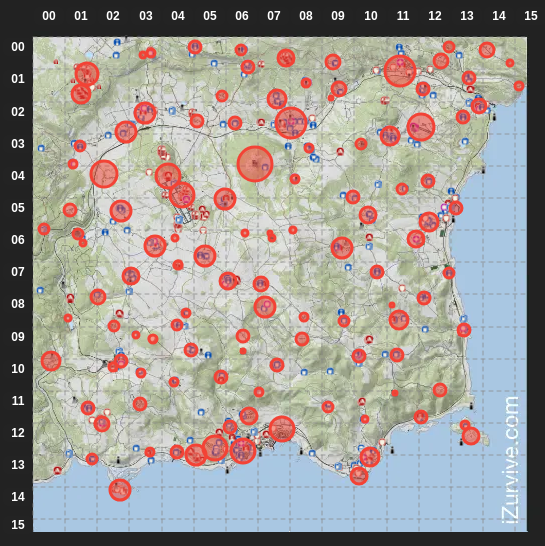

# Tracker

A DayZ mod providing server-wide individual player notifications with tracker locations.

Tracker adds a server-side tracking system using a custom item *Modified Field Transceiver*, which acts as a tracking device and sends automated location updates to players.
It is useful for event tracking, missions, bounties, or other admin-controlled gameplay scenarios, and is fully configurable via JSON settings and in-game chat commands.

### Features

- create, delete, and list named trackers (VPP Admin only)
- automatic periodic location broadcasts as
  - map grid coordinates
  - distance and direction
    - from individual player to tracker
    - nearest landmark to tracker
- landmark locations configurable via JSON


## Installation

1. place the mod folder in your server root directory
2. copy `@Tracker/keys/Tracker.bikey` to `keys/Tracker.bikey`
3. add the mod to your startup parameters `-mod="@CF;@VPPAdminTools;@Tracker"`
4. start the server and log in as admin

On first startup, the config file `tracker_settings.json` will be generated in the specified profile folder.
Edit this file to configure behavior and landmarks.


### Requirements

- CF
- VPPAdminTools


## Chat Commands and Settings

| Command                              | Description                                                   | Related Setting  | Default Value                       |
| ------------------------------------ | ------------------------------------------------------------- | ---------------- | ----------------------------------- |
| `/tracker create <name>`             | creates a named tracker at your position                      | -                | -                                   |
| `/tracker delete <name>`             | deletes tracker by name                                       | -                | -                                   |
| `/tracker list`                      | shows all tracker positions (admin override)                  | -                | -                                   |
| `/tracker set interval <seconds>`    | sets update interval                                          | `updateInterval` | 60 seconds                          |
| `/tracker set mindistance <meters>`  | sets distance threshold until which detailed info is provided | `minDistance`    | 50 meters                           |
| `/tracker set holder <on/off>`       | include player holding the tracker in updates                 | `includeHolder`  | false (0)                           |
| `/tracker set gridinfo <on/off>`     | enable grid coordinate output                                 | `gridInfo`       | true (1)                            |
| `/tracker set playerinfo <on/off>`   | enable player-relative distance/direction                     | `playerInfo`     | true (1)                            |
| `/tracker set landmarkinfo <on/off>` | enable landmark-relative distance/direction                   | `landmarkInfo`   | true (1)                            |
| `/tracker reload`                    | reloads JSON settings file                                    | -                | -                                   |
| -                                    | mapping of registered landmarks to position vectors           | `landmarks`      | {"Tri Kresta": [331, 0, 9379], ...} |

### Message Format

Example:

```
[Tracker] Alpha at X:45 Y:92 (312 m north-east of you), 120 m south of Devil's Castle
```

Output depends on enabled settings.
E.g. if a player is within `minDistance` (e.g. = 50), the message changes to:

```
[Tracker] Alpha at X:45 Y:92 (you are within 50 m), 120 m south of Devil's Castle
```

### Landmarks

The default landmarks are based on the list of Chernarus locations from the [DayZ Wiki](https://dayz.fandom.com/wiki/Locations).
These are estimated coordinates of the center of a location based on the iZurvive Map.
The categories *Hills and Mountains*, *Lakes, Ponds and Dams* and *Sea and Coast* were omitted.
Some locations were split into multiple landmarks due to their size.
Two locations (*Tri Kresta* and *Radio Zenit*) were added.
The list can be modified via the `landmarks` variable in the JSON settings file.

This map shows an overview over the registered default locations.
The size of the circles has no meaning and is only there for visualization.



## Links, Bug Reports and Suggestions

Download from steam workshop: [Tracker](https://steamcommunity.com/sharedfiles/filedetails/?id=3664351520)  
You can report bugs by creating an issue on [GitHub](https://github.com/lukasstorck/dayz-tracker/issues/new).
